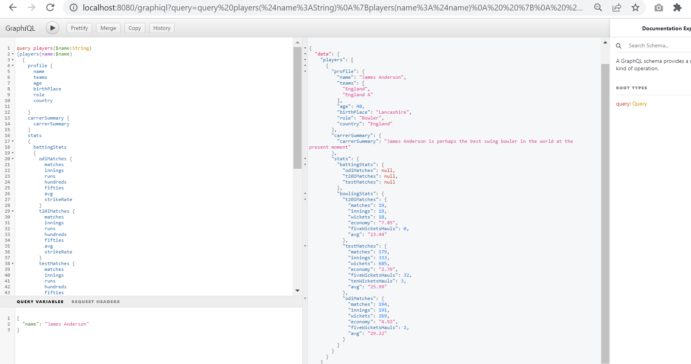

# mongodb-catalogue-service
## Steps to Run App
Import the project and run as SpringBootApp
* From Browser open url "http://localhost:8080/graphiql" 
* From Postman use url "http://localhost:8080/graphql"


# To get all the default data use the below query without passing any graphql Variables 
```
query players($name:String)
{players(name:$name)
{
profile {
name
teams
age
birthPlace
role
country

    } 
    carrerSummary {
      carrerSummary
    }
    stats
    {
      battingStats
      {
        odiMatches {
          matches
          innings
          runs
          hundreds
          fifties
          avg
          strikeRate
        }
        t20IMatches {
          matches
          innings
          runs
          hundreds
          fifties
          avg
          strikeRate
        }
        testMatches {
          matches
          innings
          runs
          hundreds
          fifties
          avg
          strikeRate
        }
      }
bowlingStats
{

t20IMatches {
matches
innings
wickets
economy
fiveWicketsHauls
avg
}
testMatches {
matches
innings
wickets
economy
fiveWicketsHauls
tenWicketsHauls
avg
}
odiMatches {
matches
innings
wickets
economy
fiveWicketsHauls
avg
}
}
}


}
}

```


# To get the players with Name pass the name as graphql varaibles with above query 

## For Any Query Contact 
Shivam Dwivedi
8318195007
